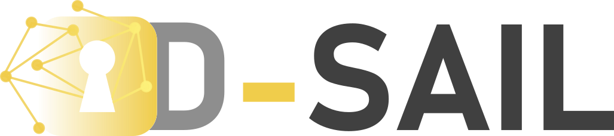

# D-SAIL - Distributed Secure AI Learning



Welcome to the D-SAIL's Github repository!

[](https://d-sail.readthedocs.io/en/latest/?badge=latest)

The documentation of the code is available on [readthedocs](https://d-sail.readthedocs.io/en/latest/)

## Description

In short, this repository currently hosts code to pseudonymized or anonymized medical images in the DICOM format and train models using PyTorch in a distributed fashion, using PyTorch. 

The general framework encompasses tools allowing the training of a global model from multiple sub-models. The main advantage is that the participants do not exchange their local data while benefiting from a presumably higher performing model. In exchange, the partners need to train a similar model on their local data. Particularly, in federated learning, a consortium of actors share the weights of their locally trained model and a central unit aggregates the latter. Although it allows the partners to only share their model's gradients and weights, the architecture also raises several challenges to ensure a privacy-preserving system.  First, the pseudonymization of the training dataset. Secondly, the confidentiality of the models and the gradients has to be guaranteed to prevent any reverse engineering to the training dataset. Eventually, the protection of the model against degradation by training on inadequate data.  

## Data Preparation

0. Clone the repository

```
git clone https://github.com/XavierLessage/D-SAIL.git
cd ResidualsTracking
```

1. Create the environment with Anaconda

```
conda env create -f d-sail.yml
```

2. Create the data folders

```
mkdir data
mkdir data/output
mkdir data/input
mkdir data/input/class0
mkdir data/input/class1
...
```

Next, copy all your DICOM files in the appropriate folders.

3. Call the script to add the labels in the DICOM files

Check the path to your Python interpreter of your Anaconda environment, then run the command with your own path.

```
E:/Anaconda3/envs/d-sail/python.exe dicom_converter/add_metadata.py path/to/input_folder 'value' '[tag]'
```

For instance:
```
E:/Anaconda3/envs/d-sail/python.exe  ~/d-sail/data/input/class1 '1' '[0x0014, 0x2016]'
```

4. Copy all files from different classes and place it together in the same folder:

```
mkdir data/input/all
cp -R data/input/class0/* data/input/all
cp -R data/input/class1/* data/input/all
...
```

5. Pseudonimization & Hashing of DICOM files:

```
E:/Anaconda3/envs/d-sail/python.exe dicom_pseudonimizer/anonymizer.py data/input/all data/input/all-pseudo --lookup=path/to/lookup_table.csv
```

For instance:

```
E:/Anaconda3/envs/d-sail/python.exe dicom_pseudonimizer/anonymizer.py path/to/input_folder path/to/output_folder --lookup=path/to/lookup_table.csv
```

If you wish to have you files renamed with the pseudonimized information, add the `--renameFiles` option

6. Decompose DICOM files to PNG and JSON files

`TODO, currently in a utility module`

7. Classify the data in different class folders 

```
E:/Anaconda3/envs/d-sail/python.exe dicom_pseudonimizer/anonymizer.py path/to/input_folder '[tag]' path/to/output_folder
```

For instance:
```
E:/Anaconda3/envs/d-sail/python.exe dicom_pseudonimizer/anonymizer.py data/input/all-pseudo '[tag]' data/output
```

8. Divide the data in train/valid/test folders:

`TODO, currently in a utility module`

9. Split the data in multiple datasets, e.g. to get one for each hospital:

`TODO, currently in a utility module`

## Federated Learning

`TODO`

## References

The code to pseudonimize the DICOM files was adapted from https://github.com/KitwareMedical/dicom-anonymizer, please refer to their repository for details on initial implementation.
